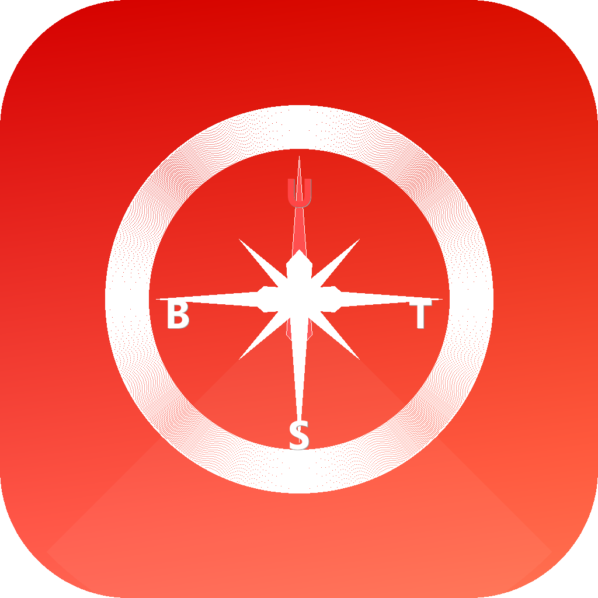

<div align="center">
  <br>
  
  <br>
  <h1>📰 REEDSFEED</h1>
  <p><strong>Berita & Headline Terkini — Multi-Platform</strong></p>
  <p>
    Aplikasi berita multi-platform yang dibangun dengan <strong>Flutter</strong> — 
    menyajikan headline terkini dari berbagai kategori dalam gaya visual <strong>ESPN</strong> 
    yang tegas, cepat, dan nyaman dibaca. Dilengkapi <strong>offline caching</strong>,
    <strong>animasi premium</strong>, dan <strong>bookmark persisten</strong>.
  </p>
  
  <p>
    
    
    
    
    
    
  </p>
  
  <br>
</div>

---

## 📋 Daftar Isi

- [✨ Fitur Unggulan](#-fitur-unggulan)
- [📸 Tampilan Aplikasi](#-tampilan-aplikasi)
- [🏗️ Arsitektur Project](#️-arsitektur-project)
- [🛠️ Tech Stack](#️-tech-stack)
- [🚀 Cara Menjalankan](#-cara-menjalankan)
- [📁 Struktur Folder Lengkap](#-struktur-folder-lengkap)
- [📦 Dependencies](#-dependencies)
- [🧭 Alur Navigasi](#-alur-navigasi)
- [📱 Cara Menggunakan](#-cara-menggunakan)
- [🔧 Konfigurasi](#-konfigurasi)
- [🐛 Troubleshooting](#-troubleshooting)
- [🤝 Kontribusi](#-kontribusi)
- [📄 Lisensi](#-lisensi)

---

## ✨ Fitur Unggulan

<table>
  <tr>
    <td width="50%">
      <h3>📰 Berita Real-Time</h3>
      <p>Headline terkini dari berbagai kategori. Data real-time dari <strong>NewsAPI</strong> dengan infinite scroll & pull-to-refresh. <strong>pageSize 15</strong> untuk performa optimal.</p>
    </td>
    <td width="50%">
      <h3>🏷️ Kategori Scroll Bar</h3>
      <p>Navigasi kategori cepat via <strong>horizontal scroll bar</strong> dengan arrow button di mobile. Di desktop, semua kategori tampil tanpa scroll. Animasi pill saat kategori dipilih.</p>
    </td>
  </tr>
  <tr>
    <td width="50%">
      <h3>🔍 Searchbar Terintegrasi</h3>
      <p>Searchbar langsung di halaman utama dengan <strong>debounce 500ms</strong>. Hasil real-time saat mengetik, tombol clear (X) yang muncul/hilang otomatis dengan <strong>ListenableBuilder</strong> optimasi.</p>
    </td>
    <td width="50%">
      <h3>💾 Bookmark Persisten</h3>
      <p>Simpan artikel favorit dengan animasi hati ❤️. Bookmark tersimpan ke <strong>database sqflite</strong> — tetap ada meskipun aplikasi ditutup. Swipe-to-delete dengan undo snackbar.</p>
    </td>
  </tr>
  <tr>
    <td width="50%">
      <h3>📱 Grid / List Toggle</h3>
      <p>Ganti tampilan berita antara <strong>list view</strong> (dengan hero card + parallax depth 3D) dan <strong>grid view</strong> (2 kolom kompak dengan efek staggered).</p>
    </td>
    <td width="50%">
      <h3>🌐 WebView Built-in</h3>
      <p>Baca artikel lengkap dalam aplikasi via <strong>WebView</strong> dengan progress bar, error handling, dan fallback browser eksternal.</p>
    </td>
  </tr>
  <tr>
    <td width="50%">
      <h3>📤 Offline Caching</h3>
      <p><strong>Network-first strategy</strong> — coba API dulu, jika gagal fallback otomatis ke cache sqflite. Cache TTL <strong>30 menit</strong>. Cache dibersihkan otomatis saat startup.</p>
    </td>
    <td width="50%">
      <h3>🎬 Parallax Hero Card</h3>
      <p>Efek <strong>parallax</strong> pada gambar headline — image bergerak 15% lebih lambat dari card saat di-scroll, menciptakan ilusi depth 3D yang dramatis.</p>
    </td>
  </tr>
  <tr>
    <td width="50%">
      <h3>⬆️ Scroll-to-Top FAB</h3>
      <p>Floating Action Button muncul otomatis saat scroll > 300px. Klik untuk kembali ke atas dengan animasi smooth.</p>
    </td>
    <td width="50%">
      <h3>🎭 Tab Transitions</h3>
      <p>Animasi <strong>Fade-in (0→1)</strong> + <strong>Scale-in (0.96→1.0)</strong> setiap ganti tab — 350ms easeOutCubic. State screen tetap terjaga via <strong>IndexedStack</strong>.</p>
    </td>
  </tr>
  <tr>
    <td width="50%">
      <h3>✨ Splash Screen Animasi</h3>
      <p>Splash dengan <strong>staggered animation</strong> — logo scale bounce + rotation, teks slide-up, dan gradient progress bar. Transisi <strong>FadeThrough</strong> ke halaman utama.</p>
    </td>
    <td width="50%">
      <h3>🌙 Dark Theme ESPN</h3>
      <p>Tema gelap khas ESPN dengan aksen merah (<code>#D50000</code>), card gelap (<code>#1E1E1E</code>), dan tipografi tebal yang nyaman di mata.</p>
    </td>
  </tr>
  <tr>
    <td width="50%">
      <h3>📤 Share Berita</h3>
      <p>Bagikan berita ke aplikasi lain via <strong>Share Plus</strong> (API terbaru) — judul + link artikel langsung terkirim.</p>
    </td>
    <td width="50%">
      <h3>💻 Multi-Platform</h3>
      <p>Berjalan di <strong>Android, iOS, Web, Windows, macOS, dan Linux</strong> — satu codebase untuk semua platform.</p>
    </td>
  </tr>
</table>

---

## 📸 Tampilan Aplikasi

```
┌──────────────────────────────────────────────┐
│               📱 APPS OVERVIEW                │
├──────────────────────────────────────────────┤
│                                              │
│  ┌────────┐  ┌──────────┐  ┌──────────┐     │
│  │ SPLASH │  │   HOME   │  │  GRID    │     │
│  │  ✨    │  │🏷️[Semua]~│  │ ┌──┐ ┌──┐│     │
│  │ REEDS  │  │ ┌──────┐ │  │ │📷│ │📷││     │
│  │ FEED   │  │ │📷 HERO│ │  │ └──┘ └──┘│     │
│  └────────┘  │ │parallax│ │  │ ┌──┐ ┌──┐│     │
│              │ ├───────┤ │  │ │📷│ │📷││     │
│  ┌────────┐  │ │📷 card│ │  │ └──┘ └──┘│     │
│  │ DETAIL │  │ ├───────┤ │  └──────────┘     │
│  │ 🌐     │  │ │📷 card│ │                    │
│  │ WebView│  │ └───────┘ │  ┌──────────┐     │
│  │ ❤️ 📤 │  └──────────┘  │ BOOKMARK  │     │
│  └────────┘               │ ❤️ ❤️ ❤️  │     │
│                           │ ← swipe ❌ │     │
│  ┌─────────┐              └──────────┘       │
│  │ SEARCH  │                                  │
│  │ (in-app)│              ┌──────────┐       │
│  │ 🔍 ...  │              │ PROFILE  │       │
│  └─────────┘              │ 👤 Info  │       │
│                           └──────────┘       │
│  ┌────── Bottom Navigation Bar ──────────┐   │
│  │ 🏠 Home │ 📑 Simpan │ 👤 Profil       │   │
│  └────────────────────────────────────────┘   │
└──────────────────────────────────────────────┘
```

---

## 🏗️ Arsitektur Project

Aplikasi ini mengikuti arsitektur berlapis yang rapi dan terstruktur:

```
┌──────────────────────────────────────────────────┐
│                   SCREENS (UI)                     │
│  Splash → Home → Detail → Bookmark → Profile     │
│               ↓ ↑          ↓ ↑        ↓           │
├──────────────────────────────────────────────────┤
│                PROVIDERS (State)                   │
│   NewsListProvider · SearchProvider · Bookmark    │
│               ↓ ↑                                │
├──────────────────────────────────────────────────┤
│              REPOSITORIES (Data Layer)              │
│              NewsRepository                       │
│               ↓ ↑                                │
├──────────────────────────────────────────────────┤
│              SERVICES (API + Cache)                │
│      NewsApiService (HTTP) · LocalDatabaseService  │
│               ↓ ↑                    (sqflite)    │
├──────────────────────────────────────────────────┤
│               MODELS (Data)                       │
│              NewsArticle                          │
└──────────────────────────────────────────────────┘
```

**Prinsip alur data:** `Screen → Provider → Repository → Service → Model`

**Strategi Caching: Network-first**
1. Coba fetch dari **NewsAPI** (via HTTP)
2. Jika berhasil → simpan ke **cache sqflite** (fire-and-forget)
3. Jika gagal (offline/error) → **fallback otomatis** ke cache
4. Cache TTL **30 menit** — expired cache dibersihkan saat startup

**Bookmark Persistence:**
- Setiap toggle bookmark → langsung sync ke database sqflite
- Saat startup → load semua bookmark dari database
- Data tetap ada meskipun aplikasi ditutup paksa

---

## 🛠️ Tech Stack

| Kategori | Teknologi | Kegunaan |
|---|---|---|
| **Framework** | [Flutter](https://flutter.dev) 3.44.6 | UI multi-platform |
| **Bahasa** | [Dart](https://dart.dev) 3.12.2 | Logic & structure |
| **State Management** | [Provider](https://pub.dev/packages/provider) | State management reaktif |
| **HTTP Client** | [http](https://pub.dev/packages/http) | REST API calls |
| **API Berita** | [NewsAPI](https://newsapi.org) | Sumber data berita |
| **Local Database** | [sqflite](https://pub.dev/packages/sqflite) | Offline cache & bookmark persist |
| **Cache Gambar** | [cached_network_image](https://pub.dev/packages/cached_network_image) | Loading & caching gambar dari URL |
| **WebView** | [webview_flutter](https://pub.dev/packages/webview_flutter) | Baca artikel in-app |
| **Share** | [share_plus](https://pub.dev/packages/share_plus) | Bagikan berita (API terbaru) |
| **URL Launcher** | [url_launcher](https://pub.dev/packages/url_launcher) | Buka link eksternal |
| **Env Variables** | [flutter_dotenv](https://pub.dev/packages/flutter_dotenv) | API key management |
| **Animasi Loading** | [shimmer](https://pub.dev/packages/shimmer) | Skeleton loading effect |
| **Format Tanggal** | [intl](https://pub.dev/packages/intl) | Format waktu relatif |
| **Ikon Aplikasi** | [flutter_launcher_icons](https://pub.dev/packages/flutter_launcher_icons) | Generate icon multi-resolusi |

---

## 🚀 Cara Menjalankan

### 📋 Prasyarat

| Kebutuhan | Versi Minimum |
|---|---|
| Flutter SDK | `3.12.2` |
| Dart SDK | `3.12.2` (bundled with Flutter) |
| Android SDK | API level 21+ |
| News API Key | [Daftar gratis](https://newsapi.org) |

### 🔧 Langkah-langkah

#### 1️⃣ Clone Repository

```bash
git clone https://github.com/kerlan404/berita--headline-olahraga-politik-teknologi-dan-dll-.git
cd berita--headline-olahraga-politik-teknologi-dan-dll-
```

#### 2️⃣ Setup Environment Variables

Buat file `.env` di root project:

```env
NEWS_API_KEY=your_api_key_here
NEWS_API_BASE_URL=https://newsapi.org/v2
```

> **Dapatkan API Key:**
> 1. Buka [newsapi.org](https://newsapi.org)
> 2. Register / Login
> 3. Copy API Key dari dashboard
> 4. Paste ke file `.env`

#### 3️⃣ Install Dependencies

```bash
flutter clean
flutter pub get
```

#### 4️⃣ Generate App Icons (opsional)

```bash
dart run flutter_launcher_icons
```

#### 5️⃣ Jalankan Aplikasi

```bash
# Android (HP/Emulator)
flutter run -d android

# iOS (Simulator/Device — butuh Mac)
flutter run -d ios

# Web Browser
flutter run -d web

# Desktop
flutter run -d windows   # Windows
flutter run -d macos     # macOS
flutter run -d linux     # Linux
```

#### 6️⃣ Build Production

```bash
flutter build apk --release           # Android APK
flutter build appbundle --release     # Android AppBundle
flutter build ios --release           # iOS IPA
flutter build web                     # Web
```

---

## 📁 Struktur Folder Lengkap

```
📦 berita--headline-olahraga-politik-teknologi-dan-dll-
├── 📁 lib/                            # 📱 Source code utama
│   ├── 📄 main.dart                    # Entry point — init DB, load .env, run app
│   ├── 📄 app.dart                     # MaterialApp + MultiProvider + load bookmark
│   │
│   ├── 📁 core/                        # ⚙️ Konfigurasi inti
│   │   ├── 📁 constants/
│   │   │   └── api_constants.dart      # Base URL, kategori, mapping
│   │   ├── 📁 theme/
│   │   │   └── app_theme.dart          # Dark theme ESPN (warna, tipografi)
│   │   └── 📁 utils/
│   │       ├── date_formatter.dart     # Format waktu relatif ("2 jam lalu")
│   │       └── route_transitions.dart  # Animasi navigasi + staggered list
│   │
│   ├── 📁 data/                        # 📊 Lapisan data
│   │   ├── 📁 models/
│   │   │   └── news_article.dart       # Model berita + fromJson/toJson
│   │   ├── 📁 services/
│   │   │   ├── news_api_service.dart   # HTTP calls ke NewsAPI + mock data fallback
│   │   │   └── local_database_service.dart # sqflite — cache & bookmark persist
│   │   └── 📁 repositories/
│   │       └── news_repository.dart    # Network-first + cache fallback
│   │
│   ├── 📁 providers/                   # 🗂️ State management
│   │   ├── news_list_provider.dart     # List berita + pagination (pageSize: 15)
│   │   ├── search_provider.dart        # Pencarian + debounce 500ms
│   │   └── bookmark_provider.dart      # Bookmark ❤️ persist ke database
│   │
│   ├── 📁 screens/                     # 🖥️ Halaman aplikasi
│   │   ├── 📁 splash/
│   │   │   └── splash_screen.dart      # Splash animasi staggered (scale + rotation + slide)
│   │   ├── 📁 main/
│   │   │   └── main_shell.dart         # Bottom Nav Bar + tab transitions (fade + scale)
│   │   ├── 📁 home/
│   │   │   └── home_screen.dart        # Beranda (category scroll bar, searchbar,
│   │   │                               #   grid/list toggle, parallax hero, FAB)
│   │   ├── 📁 detail/
│   │   │   └── detail_screen.dart      # WebView artikel + share + bookmark button
│   │   ├── 📁 bookmark/
│   │   │   └── bookmark_screen.dart    # Artikel tersimpan + swipe-delete + undo
│   │   └── 📁 profile/
│   │       └── profile_screen.dart     # Profil & info aplikasi (statistik, credits)
│   │
│   └── 📁 widgets/                     # 🧩 Widget reusable
│       ├── news_card.dart              # Card list (gambar kiri, teks kanan)
│       ├── news_hero_card.dart         # Hero card (gambar besar + parallax depth)
│       ├── bookmark_button.dart        # Tombol hati dengan animasi bounce
│       ├── empty_state.dart            # State kosong (ilustrasi + pesan)
│       ├── error_retry_widget.dart     # State error + tombol retry
│       ├── loading_indicator.dart      # Spinner loading
│       └── shimmer_loading.dart        # Skeleton loading (list & grid variant)
│
├── 📁 android/                         # 🤖 Konfigurasi Android
├── 📁 ios/                             # 🍎 Konfigurasi iOS
├── 📁 web/                             # 🌐 Konfigurasi Web
├── 📁 windows/                         # 🪟 Konfigurasi Windows
├── 📁 macos/                           # 💻 Konfigurasi macOS
├── 📁 linux/                           # 🐧 Konfigurasi Linux
├── 📁 assets/
│   ├── 📁 icon/
│   │   └── app_icon.png                # Ikon aplikasi sumber
│   └── 📄 .env                         # Environment variables (TIDAK di-commit)
│
├── 📁 dokumen/                         # 📚 Dokumentasi project
│   ├── prd.md                          # Product Requirements Document
│   ├── desain.md                       # Panduan desain UI/UX
│   ├── integrasi.md                    # Panduan teknis integrasi
│   └── roadmap.md                      # Roadmap pengembangan
│
├── 📄 pubspec.yaml                     # Dependencies & konfigurasi
├── 📄 analysis_options.yaml            # Lint rules
├── 📄 .gitignore                       # Git ignore rules
└── 📄 README.md                        # Ini! 👋
```

---

## 📦 Dependencies

```yaml
dependencies:
  flutter:
    sdk: flutter

  # State Management
  provider: ^6.1.2

  # Networking & Data
  http: ^1.2.1
  cached_network_image: ^3.3.1

  # Local Database (Offline Cache + Bookmark)
  sqflite: ^2.4.3
  path: ^1.9.0

  # Features
  webview_flutter: ^4.7.0
  url_launcher: ^6.3.0
  share_plus: ^13.2.1
  flutter_dotenv: ^6.0.1

  # UI & Animations
  shimmer: ^3.0.0

  # Utilities
  intl: ^0.20.3
  cupertino_icons: ^1.0.8

dev_dependencies:
  flutter_test:
    sdk: flutter
  flutter_launcher_icons: ^0.14.4
  flutter_lints: ^6.0.0
```

---

## 🧭 Alur Navigasi

```
🚀 Launch
    │
    ▼
┌──────────────┐    FadeThrough    ┌────────────────────────────────────────┐
│   SPLASH     │ ────────────────→ │             MAIN SHELL                 │
│   Screen     │     (2.5 detik)   │  ┌─ BottomNavigationBar ────────────┐  │
│ ✨ Animasi   │                   │  │ 🏠 Home │ 📑 Simpan │ 👤 Profil │  │
│ staggered    │                   │  └──────────────────────────────────┘  │
└──────────────┘                   │           │          │                │
                                   │           │          │                │
                                   │    ┌──────┘          └───────┐        │
                                   │    ▼                          ▼        │
                                   │ ┌──────────┐           ┌──────────┐   │
                                   │ │   HOME   │           │ BOOKMARK │   │
                                   │ │ 📰 berita│           │ ❤️ saved  │   │
                                   │ │ 🔍 search│           │ ⬅️ swipe  │   │
                                   │ └─────┬────┘           └──────────┘   │
                                   │       │                                │
                                   │       │ push(SlideRight)               │
                                   │       ▼                                │
                                   │  ┌──────────┐                         │
                                   │  │  DETAIL  │  ┌──────────┐           │
                                   │  │🌐 WebView│  │ PROFILE  │           │
                                   │  │❤️ bookmark│  │ 👤 info   │           │
                                   │  │📤 share   │  │ stats    │           │
                                   │  └──────────┘  └──────────┘           │
                                   └────────────────────────────────────────┘
```

### Tab Transitions
Setiap ganti tab di Bottom Navigation Bar:
- **Fade-in** (opacity: 0 → 1)
- **Scale-in** (scale: 0.96 → 1.0)
- Durasi **350ms** dengan **easeOutCubic**
- State screen tetap terjaga via **IndexedStack**

---

## 📱 Cara Menggunakan

### Home Screen
| Aksi | Hasil |
|---|---|
| 🔽 **Scroll ke bawah** | Infinite scroll — berita baru termuat otomatis (pageSize 15) |
| ⬆️ **Scroll > 300px** | FAB ↑ muncul, tap untuk kembali ke atas |
| 👆 **Tap card berita** | Buka detail artikel via WebView (SlideRight animasi) |
| 👆 **Tap category pill** | Filter berita berdasarkan kategori — **"Semua"** default |
| ➡️ **Tap arrow → / ←** | Scroll kategori ke kanan/kiri (mobile) — scroll 200px per tap |
| 🔢 **Tap icon grid/list** | Ganti tampilan antara list (hero + parallax) dan grid (2 kolom) |
| 🔄 **Pull-to-refresh** | Muat ulang berita terbaru |
| ❤️ **Tap icon hati** | Simpan / hapus bookmark artikel (tersimpan ke database) |
| 🔍 **Tap search icon** | Buka searchbar di AppBar — ketik untuk mencari real-time |
| ❌ **Tap X di searchbar** | Hapus query pencarian |

### Bookmark Screen
| Aksi | Hasil |
|---|---|
| ❤️ **Lihat artikel tersimpan** | Semua artikel yang di-bookmark — tersimpan persisten |
| ⬅️ **Swipe ke kiri** | Hapus bookmark dengan **undo snackbar** (3 detik) |
| 🗑️ **Tap icon hapus semua** | Konfirmasi → hapus semua bookmark |

### Detail Screen (WebView)
| Aksi | Hasil |
|---|---|
| ❤️ **Tap hati di AppBar** | Bookmark / unbookmark artikel ini |
| 📤 **Tap share** | Bagikan ke aplikasi lain (judul + link) via Share Plus |
| 🌐 **Tap buka browser** | Buka artikel di browser eksternal (fallback jika WebView error) |
| 🔄 **Tap retry** | Muat ulang WebView jika error loading |
| 📊 **Progress bar** | Indikator loading WebView di bagian atas |

### Profile Screen
| Aksi | Hasil |
|---|---|
| 👤 **Lihat info profil** | Avatar, nama, bio |
| 📊 **Statistik** | Jumlah bookmark tersimpan |
| 🎨 **Info tema** | Informasi tema ESPN yang digunakan |
| 🙏 **Credits** | Tech stack & sumber daya yang digunakan |

---

## 🔧 Konfigurasi

### Mengubah Tema

Edit `lib/core/theme/app_theme.dart`:

```dart
static const Color primaryAccent = Color(0xFFD50000);  // Ganti warna aksen
static const Color background = Color(0xFF121212);       // Ganti background
```

### Menambah Kategori

Edit `lib/core/constants/api_constants.dart`:

```dart
static const Map<String, String> categoryMap = {
  'Semua': 'all',
  'Olahraga': 'sports',
  'Teknologi': 'technology',
  'Bisnis': 'business',
  'Hiburan': 'entertainment',
  'Kesehatan': 'health',
  // Tambah kategori baru di sini
  'Sains': 'science',
};
```

Kategori baru akan **otomatis muncul** di horizontal scroll bar tanpa perlu perubahan lain.

### Mengubah API

Edit file `.env`:

```env
NEWS_API_KEY=your_new_key
NEWS_API_BASE_URL=https://newsapi.org/v2  # Ganti ke API lain jika perlu
```

### Mengubah Ikon Aplikasi

1. Ganti `assets/icon/app_icon.png` (1024×1024)
2. Jalankan `dart run flutter_launcher_icons`
3. Rebuild aplikasi

### Mengatur Cache TTL

Edit `lib/data/services/local_database_service.dart`:

```dart
static const int _cacheTTL = 30 * 60 * 1000; // 30 menit dalam milidetik
// Ubah sesuai kebutuhan, misal 60 menit:
// static const int _cacheTTL = 60 * 60 * 1000;
```

### Mengubah pageSize

Edit provider yang sesuai:

```dart
// lib/providers/news_list_provider.dart dan search_provider.dart
final int _pageSize = 15; // Default 15, sesuaikan dengan kebutuhan
```

---

## 🐛 Troubleshooting

| Masalah | Solusi |
|---|---|
| **Build error terkait NDK** | Pastikan path project tidak mengandung karakter Unicode/Spasi. Pindahkan ke `C:\projects\` |
| **"No issues found" tapi API error** | Cek `NEWS_API_KEY` di `.env` — pastikan valid & belum expired |
| **Gambar tidak muncul** | Cek koneksi internet. `CachedNetworkImage` otomatis handle cache |
| **WebView blank putih** | Pastikan AndroidManifest.xml punya `<uses-permission android:name="android.permission.INTERNET"/>` |
| **`flutter pub get` error** | Coba `flutter clean && flutter pub get` |
| **Data tidak muncul (offline)** | Cache sqflite akan terpakai jika sebelumnya pernah loading saat online |
| **Keyboard muncul otomatis** | Sudah diperbaiki dengan menghapus autofocus pada searchbar |
| **Error build "kotlin"** | Upgrade `share_plus` ke versi terbaru & set `android.builtInKotlin=true` di `gradle.properties` |
| **Database error saat startup** | Hapus file database di direktori app: `reedsfeed_cache.db` |

### ⚡ Komands Berguna

```bash
flutter analyze            # Cek kualitas kode
dart format .              # Format otomatis
flutter test               # Jalankan unit test
flutter pub outdated       # Cek dependency usang
flutter pub upgrade        # Upgrade semua dependency
flutter build apk --release # Build APK produksi
flutter logs               # Lihat log runtime
```

---

## 🤝 Kontribusi

Kami sangat terbuka untuk kontribusi! 🎉

1. **Fork** repository ini
2. Buat **branch feature**:
   ```bash
   git checkout -b feature/KerenBanget
   ```
3. **Commit** perubahan Anda:
   ```bash
   git commit -m '✨ Menambahkan fitur keren banget'
   ```
4. **Push** ke branch:
   ```bash
   git push origin feature/KerenBanget
   ```
5. Buat **Pull Request**

### 📝 Style Guide

- Ikuti struktur folder yang sudah ada (lihat [Struktur Folder](#-struktur-folder-lengkap))
- Gunakan **Provider** untuk state management, jangan setState berlebihan
- Semua widget pakai `const` constructor jika memungkinkan
- Ikuti palet warna di `app_theme.dart` — jangan hardcode warna
- Pastikan `flutter analyze` tidak ada error sebelum commit

---

## 📄 Lisensi

```
MIT License

Copyright (c) 2026 kerlan404

Permission is hereby granted, free of charge, to any person obtaining a copy
of this software and associated documentation files (the "Software"), to deal
in the Software without restriction, including without limitation the rights
to use, copy, modify, merge, publish, distribute, sublicense, and/or sell
copies of the Software, and to permit persons to whom the Software is
furnished to do so, subject to the following conditions:

The above copyright notice and this permission notice shall be included in all
copies or substantial portions of the Software.
```

---

## 👨‍💻 Author

**kerlan404**

[](https://github.com/kerlan404)
[](https://github.com/kerlan404/berita--headline-olahraga-politik-teknologi-dan-dll-)

---

## 🙏 Credits

- **[NewsAPI](https://newsapi.org)** — Penyedia data berita
- **[Flutter Team](https://flutter.dev)** — Framework keren
- **[ESPN](https://espn.com)** — Inspirasi desain UI/UX
- **Semua kontributor** — Yang sudah membantu project ini

---

<div align="center">
  <br>
  <p>
    <strong>Dibuat dengan ❤️ oleh kerlan404</strong>
  </p>
  <p>
    <sub>Last updated: 2026-07-20</sub>
  </p>
  <br>
</div>
